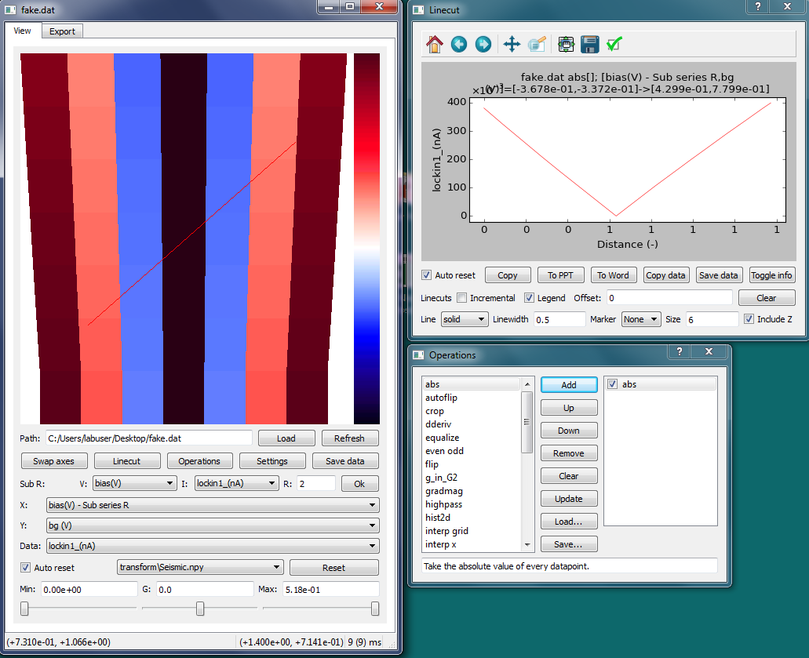
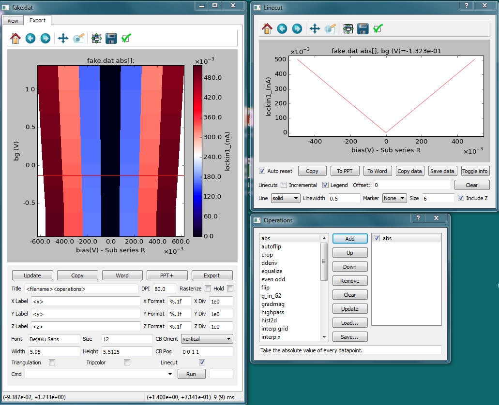

## Introduction

This is a project forked from [Rubenknex/qtplot](https://github.com/Rubenknex/qtplot). It is a very useful program to visualize 1d and 2d data. I added some new features: 

* A tcp server who talks with external programs, making it possible to show real-time diagrams programmatically.
* Some features from [Spyview](http://nsweb.tn.tudelft.nl/~gsteele/spyview/): left and right hot keys to toggle between data files; Show filter information on diagrams.
* Save plotting parameters when exported to PPT. Drag and drop .ini files to reproduce figures (colorbar, size, font, ...).
* A button to run python commands.
* Import 3D scanned data and show 2D slice by choosing the 3rd axis and the index to slice.
* Other features: Improve the "incremental" mode for better hystersis diagrams with multiple lines; Add filters that subtract Rin and normalize G/R to quantuam conductance/resistance respectively; Show multiple 2D graphs on a signle canvas. Optimize the GUI.
* ...
  
A portable version for Windows is available on this [page](https://github.com/cover-me/qtplot/releases/tag/2020.09.21).

This [video](https://cover-me.github.io/images/qtplot_with_qtlab.mp4) demos how it plots real-time data with [qtlab](https://github.com/heeres/qtlab). The GUI may be out of date.

This [video](https://cover-me.github.io/images/qtplot_plot_replot.mp4) shows how to plot data and reproduce the figure.

While qtplot is convenient for measurements, it has limitations for the publication purpose. For example, qtplot can't produce figures with multiple sub-panels. The freedom of modifying the colorbar and ticks is low. A Jupyter Notebook with pieces of code stolen from qtplot would make customizing of figures easily. Here is an example ~~[qtplotter.ipynb](/qtplotter.ipynb)~~ [qtplotter examples](https://github.com/cover-me/qtplotter/blob/master/example.ipynb).

## Installation
After installing, please delete old profiles by clicking Settings->Remove (or delete the folder C:\\Users\\username\\.qtplot) and restart the program again if you are using versions older than 2018.12.03.

### Run the excutable directly on Windows

The 7z file can be found in the [realsese](https://github.com/cover-me/qtplot/releases). Download, upzip, and run qtplot.exe. On Windows 7 one may need delete numbers in the name of the parent folder (for example, rename "qt_plot.2020.09.21" to "qtplot") and higher-level folders otherwise the program may fail to run (see logs in C:\\Users\\username\\.qtplot for more details if the program fails to run).

### Install qtplot with Anaconda Python
Qtplot is compatible with both Python 2 and 3. Using the Anaconda Python distribution (https://www.continuum.io/downloads) is recommended to make installing packages like `numpy` and `scipy` easier.

Create a new environment:

`conda create --name qtplot python=3.5`

Install qtplot:

`pip install qtplot`

Install other dependencies with:

`conda install numpy scipy pandas matplotlib pyqt=4`

Executables will be generated in the `/Scripts` folder of your Python environment with the names `qtplot.<exe>` and `qtplot-console.<exe>`. Associate one of these with `*.dat` files for them to be automatically opened in qtplot.

Keeping updated may not be a good idea. For example, there seems to be some issues with qtplot after I updated matplotlib to 3 from 1.5.3 in Ubuntu. 

### Install qtplot with WinPython (Windows Systems)
WinPython is a free open-source portable distribution of Python.

Download WinPython-32bit-2.7.9.5 installer and run it. The installer only copies files to a destination directory.
 
Open "WinPython Command Prompt.exe" in the destination directory. Type "pip install qtplot". Some of your packages may be auto degraded/updated to meet the requirement of qtplot.

Find qtplot.exe in folder \python-2.7.9\Scripts.

### Create a portable version of qtplot with PyInstaller
With PyInstaller, you can package qtplot into a small and portable folder with an executable inside.

Make sure your python meets the requirements of qtplot (by installing it with the methods above...).

Download the whole project and create a .py file in the project folder, with the following codes:
	
	from qtplot import qtplot
	qtplot.main()

Assuming the file you created names 'qt_plot.py' and WinPython-32bit-2.7.9.5 is used, open "WinPython Command Prompt.exe" and execute:

	cd [directory]
	pyinstaller --hidden-import vispy.app.backends._pyqt4 --add-data qtplot\colormaps;qtplot\colormaps --noconsole qt_plot.py

Replace [directory] with the path of your qtplot project folder.

Sometimes the excutable may fail to run on a computer because of missing init.tcl and .tk files. Click [here](https://stackoverflow.com/questions/42180492/pyinstaller-fails-on-windows-7-cant-find-a-usable-init-tcl) for a solution (I prefer copying the missing file manually).

### Run the codes directly
Make sure your python meets the requirements of qtplot (by installing it with the methods above...).

I use WinPython-32bit-2.7.9.5. So I open "WinPython Command Prompt.exe" and execute:

	cd [directory]
	python
	from qtplot import qtplot
	qtplot.main()
	
[directory] is the path of qtplot folder.

or create a .py file in the project folder with the following codes:
	
	from qtplot import qtplot
	qtplot.main()

open "WinPython Command Prompt.exe" and execute:

	python [path of the .py file]

## Data file

### .dat file (qtlab)

If a file has an extension of .dat and starts with "# Filename: " in its first line, it would be recognized as a qtlab file. A typical qtlab file is shown as following:

	# Filename: data_9.dat
	# Timestamp: Wed May 02 23:30:49 2018

	# Column 1:
	#	end: 4000.0
	#	name: dac7 (Vg(*30mV))
	#	size: 201
	#	start: 0.0
	#	type: coordinate
	# Column 2:
	#	end: 0
	#	name: y_parameter (none)
	#	size: 1
	#	start: 0
	#	type: coordinate
	# Column 3:
	#	end: 0
	#	name: z_parameter (none)
	#	size: 1
	#	start: 0
	#	type: coordinate
	# Column 4:
	#	name: lockin 1
	#	type: value

	0.000000000000e+00	0	0	0
	2.000000000000e+01	0	0	0

Lines start with a "#" are comment lines containing meta information.

The rest is data. Data is obtained by a N-dimensional scan. Each dimension of the scan corresponds to a coordinate column in the data (a column with a "type" of "coordinate"). For example, if one scans V_bias and V_gate, the setting values of V_bias and V_gate would be the coordinate columns. This program uses coordinate columns to determine how points of each line in data are arranged to plot a 2d figure.

### .dat file (QCoDeS)

Any .dat file not recognized as a qtlab file would be treated as a QCoDeS file.

### .npy file

File \[NAME\].npy could be loaded only if there exists a file named \[NAME\].meta.txt in the same directory. File \[NAME\].meta.txt should contains the meta infomation with a qtlab format.

The data is loaded by calling `np.load(self.filename, mmap_mode='r')`. The memory mapping mode is used, which is more efficient for realtime plotting with files created by other programs.

## How To

### Update the data file by an external program (python)

	import socket
	def _update_qtplot(path):
	    print 'update qtplot:',
	    try:
		s = socket.socket(socket.AF_INET, socket.SOCK_STREAM)
		s.connect(("127.0.0.1",1787))
		s.send('FILE:%s;AXES:1,2,4;SHOW:'%path)
		print s.recv(1024)
		s.close()
	    except:
		print 'socket failed.'
	_update_qtplot(PATH_OF_YOUR_DATA_FILE)

Replace 'PATH_OF_YOUR_DATA_FILE' with a real path. It will update the data file, reset the axes to 1,2,4, and show qtplot. Make sure the meta information has been flushed into the file, or the file would not be open. If you are using qtlab, there should be something looks like the following codes in your measurement script:

	data = qt.Data(filename)
	...
	data.create_file()
	
add a new line with `data._file.flush()` below `data.create_file()`, the meta information would then be flushed to the hard disk.

### Real-time plotting

Let's assume there is another program taking data and saving data into a .dat file every now and then. It is OK to update the plot by updating the .dat file and tell qtplot to reload that .dat file, for thousands of times. The operating system may do something to take care of file I/Os to save your disk's life. A more efficient way is to create a memory mapped .npy file and tell qtplot to load that file. Qtplot will memory-map that file too, so the data is shared between programs in memory directly.

## Newer screenshots

